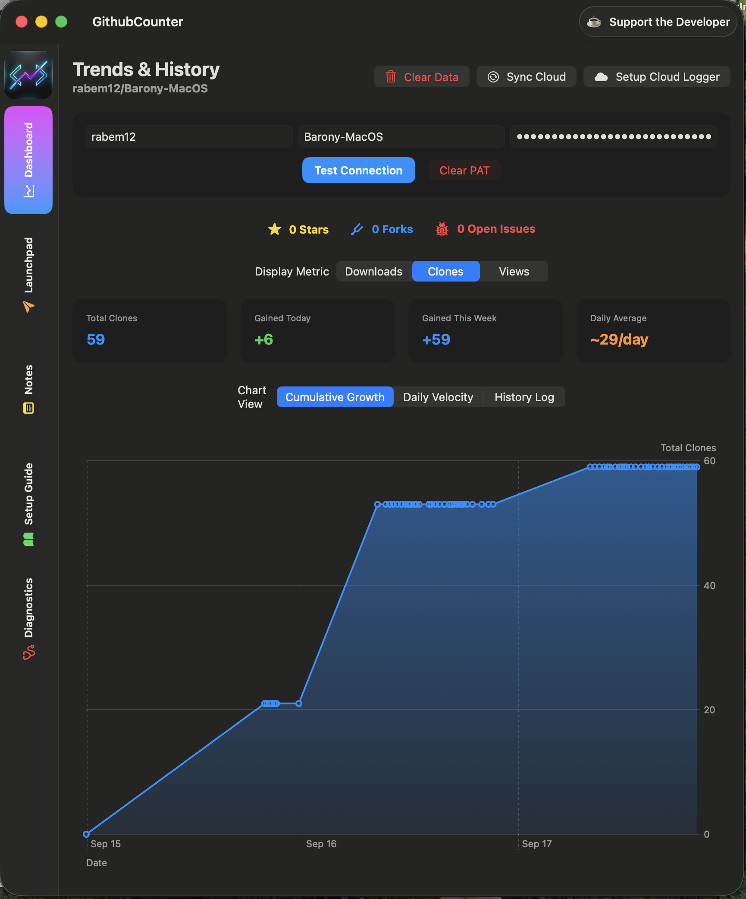
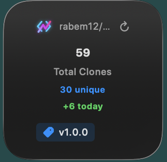
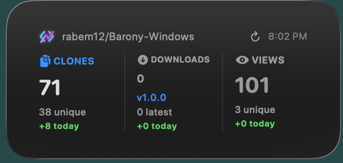
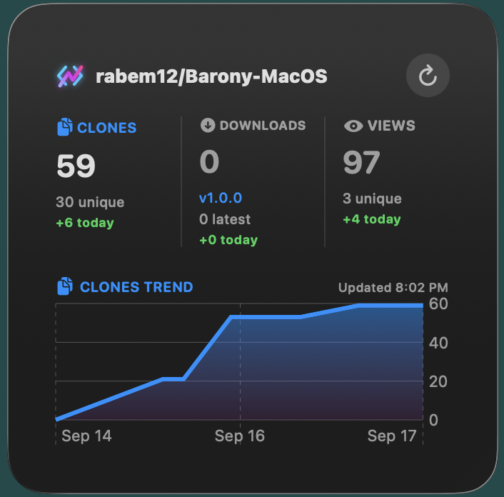
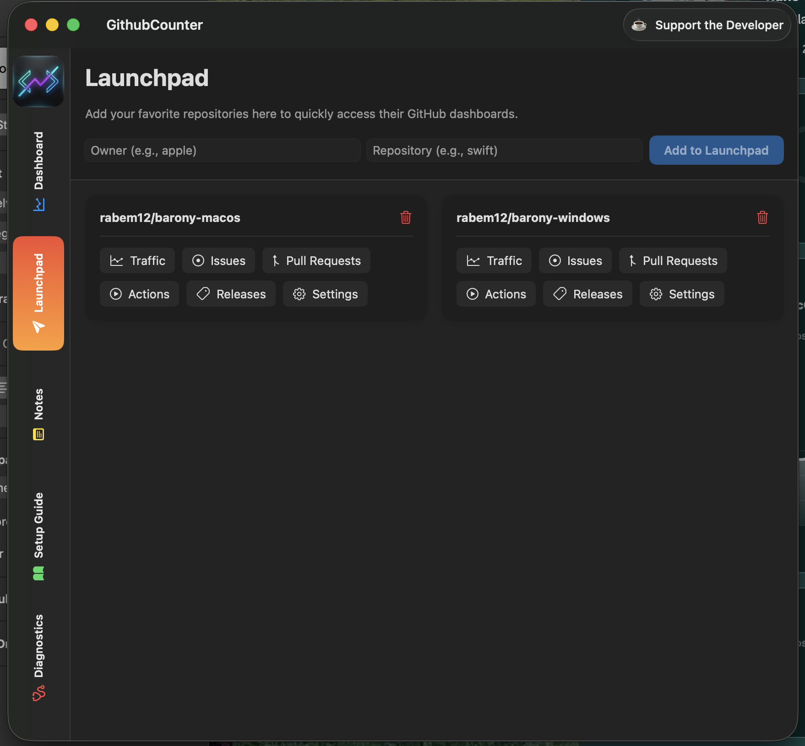
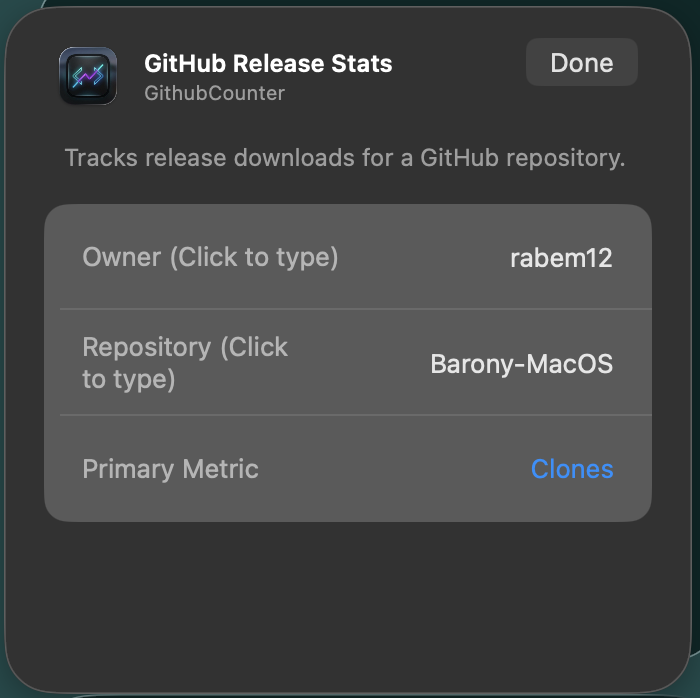

# GitCounter

<p align="center">
  <strong>Native macOS Desktop Widgets & Release Analytics for GitHub Repositories</strong>
</p>

<p align="center">
  
  
  
  
</p>

---

**GitCounter** is a lightweight, privacy-first native macOS application and WidgetKit suite that brings real-time GitHub release download counts, clone metrics, and visitor traffic directly to your desktop.

Whether you maintain open-source libraries or track releases for your favorite developer tools, GitCounter gives you immediate visibility into community adoption without opening a browser or logging into external dashboards.

---

## ✨ Features

- 🖥️ **Native Desktop Widgets**: Available in **Small**, **Medium**, and **Large** sizes with interactive, customizable primary metrics (**Downloads**, **Clones**, or **Views/Visits**).
- 🔗 **Instant Deep Linking**: Click any widget on your desktop to instantly open and view that specific repository in the GitCounter dashboard.
- 📈 **Traffic & Trend Analytics**: View 24-hour and 7-day delta metrics alongside historical snapshot charts.
- 🚀 **Launchpad Quick-Switcher**: Save and seamlessly toggle between multiple tracked repositories.
- 📝 **Scratchpad Notes**: Built-in markdown-friendly notes manager with local persistence for tracking release milestones and changelogs.
- 🔒 **Privacy-First & Secure**: Personal Access Tokens (PATs) are encrypted in your native **macOS Keychain**. Zero analytics, zero third-party telemetry, and direct TLS/HTTPS calls to `api.github.com`.

---

## 📸 Showcase

### The Unified Dashboard
Track release downloads, clone traffic, unique visitors, and star/fork counts with real-time delta trends:
<p align="center">
  
</p>

### Desktop Widgets (Small, Medium, & Large)
Native macOS widgets rendered directly on your desktop or Notification Center:
<p align="center">
  
  &nbsp;&nbsp;
  
  &nbsp;&nbsp;
  
</p>

### The Repository Launchpad
Organize, manage, and inspect all of your tracked repositories in one place:
<p align="center">
  
</p>

---

## 🚀 Installation & Setup

### Method 1: Download Pre-Built Release (Recommended)
1. Download the latest release `.zip` or `.dmg` from [GitHub Releases](../../releases).
2. Drag **GitCounter.app** to your `/Applications` folder.
3. Launch **GitCounter** once to register the widget extension with macOS.

### Method 2: Build from Source with Xcode
Prerequisites: macOS 14.0+, Xcode 15.0+, and [XcodeGen](https://github.com/yonaskolb/XcodeGen) (`brew install xcodegen`).

1. Clone this repository to your Mac:
   ```bash
   git clone https://github.com/rabem12/Github_Counter.git
   cd Github_Counter
   ```
2. Generate the Xcode project:
   ```bash
   xcodegen generate
   ```
3. Open `GithubCounter.xcodeproj` in Xcode.
4. Select the **GithubCounter** scheme, set your Development Team under **Signing & Capabilities**, and press **Cmd + R** to build and run.

---

## 🧩 Adding Widgets to Your Desktop

1. Right-click anywhere on your Mac's desktop wallpaper and select **"Edit Widgets..."**.
2. Scroll or search for **GitCounter** in the widget gallery.
3. Select your preferred size (**Small**, **Medium**, or **Large**) and drag it onto your desktop.
4. Right-click the placed widget and select **"Edit 'GitHub Release Stats'"**:
   - **Owner:** Enter the repository owner (e.g. `apple`).
   - **Repository:** Enter the repository name (e.g. `swift`).
   - **Primary Metric:** Select your preferred hero stat (**Downloads**, **Clones**, or **Views**).
5. Click anywhere outside the sheet to apply changes.

<p align="center">
  
</p>

---

## 🔒 Privacy & Security

GitCounter respects your privacy and security:
- **No Tracking:** We collect no telemetry, analytics, or user identifiers.
- **Local Keychain:** GitHub Personal Access Tokens are stored exclusively in your local macOS Keychain (`kSecClassGenericPassword`).
- **Direct Requests:** Network traffic is sent directly to `api.github.com` over secure HTTPS.

For full disclosures, review our [Privacy Policy](PRIVACY_POLICY.md).

---

## 📄 License & Ownership

GitCounter is developed and published by **Black Pinion LLC**.

All source code and documentation are licensed under the terms of the [GitCounter Software License](LICENSE).
- **Personal Evaluation:** You may inspect, clone, and build the source code for personal, non-commercial use.
- **Marketplace Prohibition:** You are strictly prohibited from publishing, distributing, or submitting this software (or derivative works) to the Apple Mac App Store, iOS App Store, or any other app marketplace without prior written consent from Black Pinion LLC.

---

## ⚖️ Trademark Notice

*Git and the Git logo are trademarks of Software Freedom Conservancy, Inc.*  
*GitCounter is an independent software tool developed by Black Pinion LLC and is not affiliated with, endorsed by, or sponsored by Software Freedom Conservancy or GitHub, Inc.*
